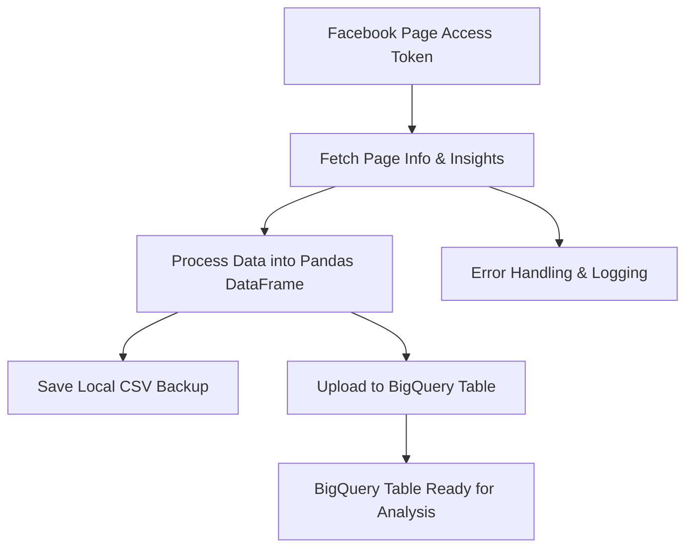
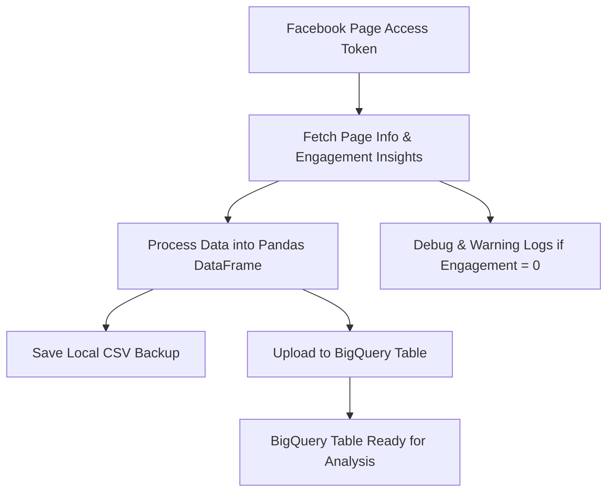

# Facebook Page Insights to BigQuery Automation

[](https://www.python.org/)
[](https://opensource.org/licenses/MIT)

This Python script automates fetching daily Facebook Page insights (reach and total page likes) and uploads the data into Google BigQuery for analytics and reporting purposes.

---

## Quickstart
1. Install dependencies:  
```bash
pip install facebook-sdk pandas google-cloud-bigquery google-auth
````

2. Configure your **Google Cloud service account** and BigQuery table.
3. Add your Facebook Pages and access tokens in the script.
4. Run the script:

```bash
python fb_insights_to_bq.py
```

---

## Features

* Fetches daily **Facebook Page likes** and **unique reach** metrics.
* Supports multiple Facebook Pages in a single run.
* Uploads processed data into **Google BigQuery**.
* Saves a local **CSV backup** of fetched data.
* Detailed logging and traceback for debugging.
* Handles **dynamic date ranges**.

---

## Requirements

* Python 3.8+
* [Facebook SDK for Python](https://pypi.org/project/facebook-sdk/)
* pandas
* google-cloud-bigquery
* google-auth

---

## Installation

```bash
git clone https://github.com/yourusername/fb-insights-to-bq.git
cd fb-insights-to-bq
```

Make sure your **Google Cloud service account JSON** file is accessible. This file is required to authenticate with BigQuery.

---

## Configuration

Edit the script to update these variables:

```python
BQ_CREDENTIALS_PATH = r"C:\path\to\your\service_account.json"
BQ_PROJECT_ID = "your-gcp-project-id"
BQ_DATASET_ID = "your_bigquery_dataset"
BQ_TABLE_ID = "your_bigquery_table"
```

---

## Facebook Pages

Add your pages and access tokens in `main()`:

```python
pages = [
    {
        'page_id': 'YOUR_PAGE_ID',
        'access_token': 'YOUR_PAGE_ACCESS_TOKEN'
    },
    ...
]
```

> **Important:**
>
> * Access tokens must have `read_insights` permission.
> * Avoid storing tokens in code for production; consider environment variables:
>
> ```python
> import os
> ACCESS_TOKEN = os.getenv("FB_PAGE_TOKEN")
> ```
>
> * Access tokens may expire. Make sure they are valid.

---

## Date Range

By default, the script fetches the last **8 days** of insights (from yesterday minus 7 days up to yesterday).

```python
from datetime import datetime, timedelta

end_date = datetime.now() - timedelta(days=1)
start_date = end_date - timedelta(days=7)
```

---

## Output

### BigQuery Table

| Page Name   | Date       | Reach  | Total Page Likes |
| ----------- | ---------- | ------ | ---------------- |
| ExamplePage | 2026-02-12 | 12,345 | 6,789            |

### CSV Backup

A CSV file is saved locally for each page:

```
fb_insights_<PageName>_<start_date>_to_<end_date>.csv
```

Example:

```
fb_insights_ExamplePage_2026-02-12_to_2026-02-19.csv
```

---

## Workflow



---

## Error Handling

* Facebook API errors are caught and printed with traceback.
* Upload errors to BigQuery are logged in detail.
* Pages that fail to fetch or upload data are tracked in `error_pages`.

---

## Notes & Best Practices

* Ensure your Google Cloud service account has permission to write to BigQuery.
* Use a dedicated access token for insights fetching.
* Validate all pages and tokens before running.
* Temporary CSV files are cleaned up automatically.
* Debug logs include a metrics summary and a full data preview.

---

## License

This project is licensed under the MIT License.

---

# Facebook Page Engagement Collector to BigQuery

[](https://www.python.org/)
[](https://opensource.org/licenses/MIT)

This Python script automates the collection of **daily Facebook Page engagement metrics** (post engagements) and uploads the data into **Google BigQuery**. It supports multiple Facebook Pages in one run, saves CSV backups, and provides detailed debug output for troubleshooting.

---

## Quickstart

1. Install dependencies:
```bash
pip install facebook-sdk pandas google-cloud-bigquery google-auth
````

2. Configure your **Google Cloud service account** and BigQuery table.

3. Add your Facebook Page IDs and access tokens in the `pages` list in the script.

4. Run the script:

```bash
python fb_engagement_collector.py
```

---

## Features

* Collects daily **page_post_engagements** for multiple Facebook Pages.
* Handles dynamic **date ranges**.
* Saves **CSV backup** for each page.
* Uploads processed data to **BigQuery**.
* Prints detailed **debug logs** including raw API responses and warnings if all engagement values are 0.
* Verifies if posts exist when engagement data is missing.

---

## Requirements

* Python 3.8+
* [Facebook SDK for Python](https://pypi.org/project/facebook-sdk/)
* pandas
* google-cloud-bigquery
* google-auth

---

## Configuration

Edit these constants in the script:

```python
BQ_CREDENTIALS_PATH = "C:\\path\\to\\service_account.json"
BQ_PROJECT_ID = "your-gcp-project-id"
BQ_DATASET_ID = "your_bigquery_dataset"
BQ_TABLE_ID = "fb_engagements_automation"
```

Add your Facebook Pages and access tokens in the `pages` list:

```python
pages = [
    {
        'page_id': '1234567890',
        'access_token': 'EAA...'
    },
    ...
]
```

> **Important:**
>
> * Access tokens must have `read_insights` permission.
> * Avoid storing tokens in code for production; use environment variables.
> * Access tokens expire—ensure they are valid.

---

## Date Range

By default, the script fetches engagement data for a **specific date range**:

```python
start_date = "2026-02-01"
end_date = "2026-02-08"
```

---

## Output

### BigQuery Table

| Page Name   | Date       | Engagements |
| ----------- | ---------- | ----------- |
| ExamplePage | 2026-02-01 | 123         |
| ExamplePage | 2026-02-02 | 456         |

### CSV Backup

```text
fb_engagement_<PageName>_<start_date>_to_<end_date>.csv
```

Example:

```text
fb_engagement_ExamplePage_2026-02-01_to_2026-02-08.csv
```

---

## Workflow



---

## Debugging & Warnings

* If **all engagement values are 0**, the script will:

  1. Check if posts were actually made during the date range.
  2. Print possible reasons:

     * Posts exist but received 0 engagements.
     * Metric may not be available for the page.

* Raw API responses are printed for verification.

---

## Error Handling

* API errors are caught and displayed with traceback.
* Failed uploads to BigQuery are logged.
* Pages with invalid or missing tokens are skipped.

---

## Notes & Best Practices

* Ensure the service account has **write access to BigQuery**.
* Use dedicated access tokens for insights fetching.
* Validate Facebook Pages and tokens before running.
* Temporary CSV files are cleaned up automatically.
* Backups allow manual verification if needed.

---

## Summary

The script prints a summary of results:

```text
Summary: 25 pages processed successfully, 3 pages failed.
```

---

## License

This project is licensed under the **MIT License**.

---

Perfect — just like the previous script, you can create a **`README.md`** for this LiveChat transcript downloader so anyone (or future you) can quickly understand, set up, and run it. Here’s a ready-to-paste version tailored to your code:

---

# LiveChat Transcript Downloader to BigQuery

This Python script automates downloading LiveChat transcripts and uploading them directly to **Google BigQuery**. It also allows processing chat data into CSV if needed.

---

## Features

* Download chat transcripts for:

  * Last 7 days (default)
  * Custom date ranges
* Extract detailed chat info:

  * Chat ID, Agent/Client info, Contact Date
  * Chat status, ratings, case resolution, visitor comments
  * Queued time, chatting duration, device & OS info
  * Conversation history with proper tagging
* Upload processed data directly to **BigQuery**
* Handle multiple agents and multiple chat events
* Converts UTC timestamps to **Philippine Time (+8)**

---

## Prerequisites

1. Python 3.8+
2. Packages:

```bash
pip install requests google-cloud-bigquery google-auth
```

3. Google Cloud service account JSON key file with **BigQuery Data Editor** access.

4. LiveChat account with:

   * **Account ID**
   * **Personal Access Token (PAT)**

---

## Configuration

Update these constants in the script:

```python
DATASET_ID = "Livechat_Data"            # BigQuery dataset name
TABLE_ID = "Livechat_Raw_Data_V2"       # BigQuery table name
CREDENTIALS_PATH = "path/to/key.json"   # JSON key file path
```

---

## Usage

Run the script:

```bash
python livechat_downloader.py
```

The script will prompt:

1. **Account ID**
2. **Personal Access Token**
3. **Date range option**:

   * `1` → Last 7 days
   * `2` → Custom date range (YYYY-MM-DD format)

It will fetch chats, process them, and upload to BigQuery.

---

## BigQuery Upload

* The script uses `google.cloud.bigquery` with the service account JSON.
* Ensures all `TIME` fields (`Started Time`, `EndTime`, `Chatting Time`, `Queued Time`) are in valid format (`HH:MM:SS`) to prevent insert errors.
* Errors are logged without stopping the entire upload.

---

## CSV Export (Optional)

You can process raw JSON into a CSV for offline analysis:

```python
process_raw_chats('raw_chats_data.json', 'output.csv')
```

Fields include:

* `Contact Date`, `Agent Alias`, `Agent Name`, `Chat ID`
* `Lead Name`, `Lead Email`, `Lead Address`, `Lead Country`
* `Rating`, `Chat Status`, `Website Origin`, `Website`
* `Campaign`, `Started Time`, `EndTime`, `Chatting Time`
* `Queued Time`, `Came from`, `Case Resolved`, `Website Rating`
* `OS`, `Browser`, `Visitor's Comments`, `Device`, `Conversation`

---

## Notes

* PH Time conversion is **UTC +8**
* Handles missing or malformed timestamps, defaulting to `"00:00:00"`
* Multi-region PATs (`dal:`, `fra:`) automatically set the `X-Region` header for LiveChat API
* Unknown agents default to `'Unassigned'`
* Visitor comments, chat ratings, and post-chat forms are extracted when available

---

## Example

```bash
LiveChat Transcript Downloader
------------------------------
IMPORTANT: You'll need both your Account ID and Personal Access Token
1. Account ID can be found in the LiveChat Console URL or Developer Console
2. Personal Access Token from Developer Console

Please enter your Account ID: 12345
Please enter your Personal Access Token: abcde-12345
Would you like to:
1. Download last 7 days
2. Specify custom date range
Enter choice (1 or 2): 1
Fetching chats from 2026-02-13T10:00:00.000000Z to 2026-02-20T10:00:00.000000Z
Successfully uploaded 125 rows to BigQuery
```

---

